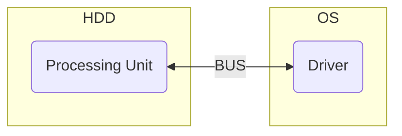

# Let's Get SMART
Getting S.M.A.R.T. attributes from HDD and SSDs

```mermaid
  flowchart LR
      A(Processing Unit)<-- BUS -->C(Driver)
      subgraph HDD
      A(Processing Unit)
      end
      subgraph OS
      C(Driver)
      end
```
      
